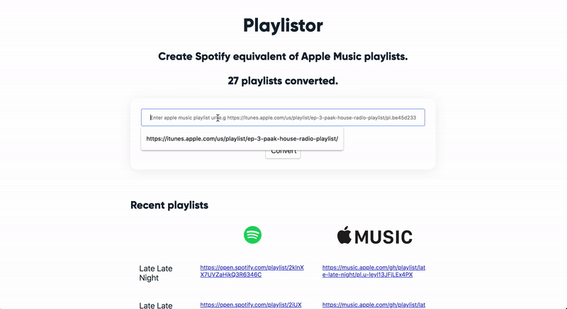

## Playlistor
self-hosted apple music to spotify playlist convertor

[](https://circleci.com/gh/akornor/playlistor/tree/master)

## Demo


## Installing
For simplicity, you'll need [docker](docker.com) and [docker-compose](https://docs.docker.com/compose/) to run playlistor in development. Create `.env` file and set the appropriate environment variables. For example:
```
	REDIS_URL=redis://redis:6379
	SPOTIFY_REDIRECT_URI=http://localhost:8000/callback
	SPOTIFY_CLIENT_ID=Loremipsumdolorsitamet
	SPOTIFY_CLIENT_SECRET=Loremipsumdolorsitamet
	APPLE_KEY_ID=Loremipsumdolorsitamet
	APPLE_TEAM_ID=Loremipsumdolorsitamet
	APPLE_PRIVATE_KEY=Loremipsumdolorsitamet
```
Then run `docker-compose up` to get things running.

## Usage
Navigate to `localhost:8000`. You'll be required to login with your Spotify credentials on first attempt.

## TODO
- [X] Add feature to convert apple music playlist to spotify

## Thanks and Acknowledgments
Thanks to Maame, Mayor, Samuel, Elikem, Diayan, Ike, Paul and Christian for helping me put this together. Not sure we'll have playlistor without you guys.
