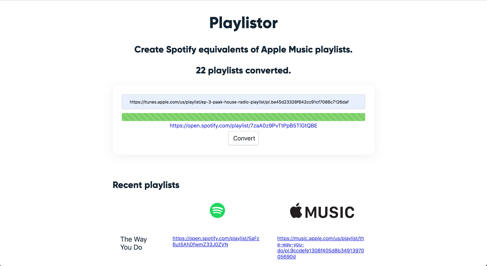

## Playlistor
self-hosted apple music to spotify playlist convertor

## Demo

## Installing
This assumes you have python 3.6 or higher, [foreman](https://www.npmjs.com/package/foreman) and [redis](https://redis.io/topics/quickstart) installed.
Clone repository or download zip and extract. Open terminal and navigate to `playlistor`. Run the following commands to create virtual environment and install dependencies.

* `python3 -m"venv" env && . env/bin/activate`
* `pip3 install -r requirements.txt`

Before starting the app, copy `env.sample` to `.env`, set all the required environmental variables in the `.env` file. Make sure redis running in another terminal on port `6379`.
You can now run the app with `nf start --port 8000`.

## Usage
To use app, navigate to `localhost:8000`. You'll be required to login with your Spotify credentials on first attempt.

## TODO
- [ ] Add feature to convert apple music playlist to spotify
